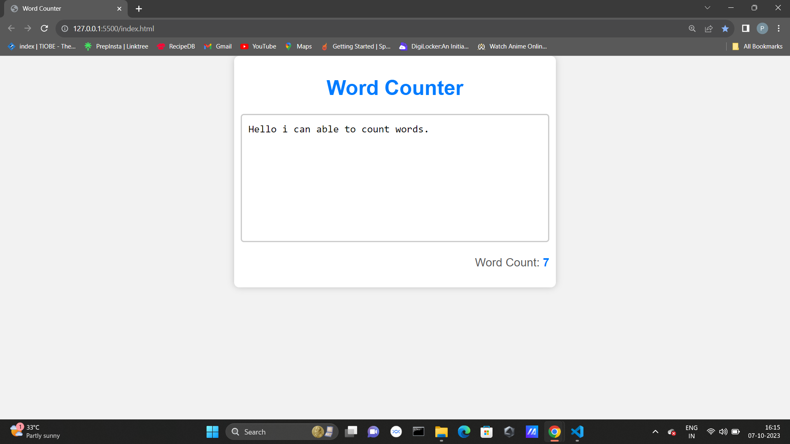

# Word Counter

A simple web application that counts the number of words in a given text.

## Table of Contents

- [Description](#description)
- [Features](#features)
- [Usage](#usage)
- [Screenshots](#screenshots)
- [License](#license)

## Description

Word Counter is a basic web application that allows users to input or paste text, and it will calculate the number of words in the text. It's a handy tool for quick word count checks.

## Features

- Counts the number of words in the entered text.
- Provides a user-friendly interface.
- Responsive design for various screen sizes.

## Usage

1. Visit the Word Counter web page.
2. Enter or paste your text into the text area.
3. The word count will be displayed in real-time below the text area.

## Screenshots

## License

This project is licensed under the MIT License - see the [LICENSE](LICENSE) file for details.
